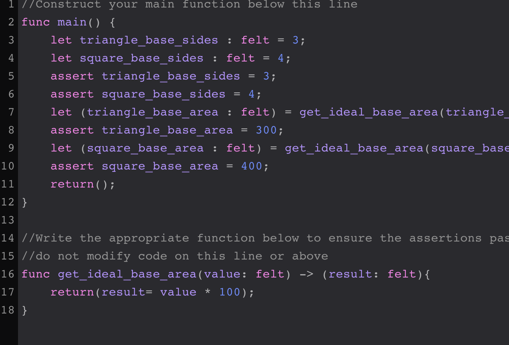

### Lección 2

Una función puede recibir parametros y retornar valores.  
Para esta lección crearemos una función con nombre `get_ideal_base_area` que recibira un parametro de tipo `felt` y retornara el resultado de multiplicar el parametro de entrada por 100.  

**Solución:**  

***

### Lección 3

Funciones Logicas y Condicionales.  

Una instruccion condicional comienza con la palabra `if` seguido de parentesis `()` y la comparacion dentro de los parentesis ej. `(1 > 9)`,  el resultado  de la evaluación regresa un `true` o un `false`, si el resultado es `true` entonces se ejecuta el codigo que esta dentro del cuerpo de la condición, si es `false` entonces se salta ese codigo  y no  se ejecuta.

**Solución:**  

# Modulo 0 Finalizado #

---
